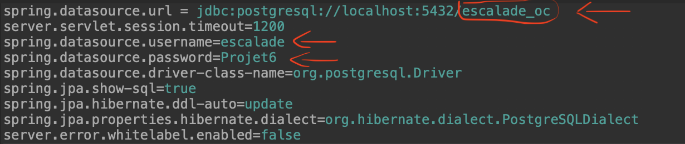
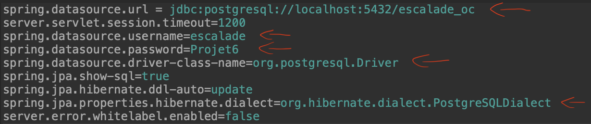

# Projet 6 - Site web d'une association d'escalade

## Contenu

Ce projet est un site web communautaire permettant aux adaptes de l'escalade de pouvoir se renseigner sur des sites d'escalade, de partager leurs expériences sur différents sites, en laissant des commentaires, d'ajouter d'autres spots et d'ajouter plus d'informations sur des spots déjà présents.

Il est possible aussi, pour des utilisateurs connectés, d'ajouter des topos, de faire une demande de prêt d'un topo au propriétaire et d'accepter ou de refuser le prêt.

------------------------

## Prérequis

* Java version 1.8
* Maven 3.6

------------------------

## Base de données

Les scripts SQL présents dans src/main/resources/script_sql permettent de créer les tables d'une base de données avec un jeu de données.

Exécutez les scripts, après avoir créé une base de données, dans cet ordre :

* Création des tables : 
    
    * script_table.sql

* Alimentation des données : 
    
    * jeu_de_donnees.sql

Le SGBD (Système de Gestion de Base de Données) configuré dans ce projet est postgreSQL, si vous utilisez aussi postgreSQL, il faudra alors, pour pouvoir connecter l'application à la base de données, changer :

1. le nom de la base de données, que vous souhaitez utiliser

2. le nom de l'utilisateur 

3. le mot de passe 

dans le fichier "application.properties" qui se trouve dans le chemin src/main/resources/application.properties comme illustré dans l'image suivante.

Si vous utilisez un autre SGBD, il faudra alors, pour pouvoir connecter l'application à la base de données, changer :

1. l'url de la base de données, que vous souhaitez utiliser

2. le nom de l'utilisateur

3. le mot de passe

4. le "spring.datasource.driver-class-name"

5. le "spring.jpa.properties.hibernate.dialect"

dans le fichier "application.properties" qui se trouve dans le chemin src/main/resources/application.properties comme illustré dans l'image suivante.

Une fois l'application démarrée, vous pourrez vous connecter via les utilisateurs enregistrés dans le jeu de données fourni, il faudra utiliser les identifiants et mots de passe suivant :

Pour un ADMIN :

* identifiant = ponpon
* mot de passe = jean
* statut = ADMIN

Pour un MEMBRE :

* identifiant = memer56
* mot de passe = robert
* statut = MEMBRE

Pour un USER :

* identifiant = riri
* mot de passe = patrick
* statut = USER

------------------------

## Installation et déploiement

### Déploiement avec ou sans conteneur web préinstallé

L'application peut être déployée de deux façons:

1. sous forme d'une application "standalone" intégrant un conteneur web (grâce à SpringBoot)

2. sous forme d'une webapp traditionnelle (war) à déployer dans le répertoire webapps d'un conteneur web (comme Tomcat, par exemple)

### Déploiement sans conteneur web

* récuperez le projet Github en copiant ce lien : https://github.com/Kamel94/escalade.git

* ouvrez le terminal ou la console, placez-vous dans le dossier où vous voulez déposer le projet

* clonez le projet Github en exécutant cette commande : 

    * git clone https://github.com/Kamel94/escalade.git

* placez-vous dans le dossier escalade

* exécutez la ligne de commande :

    * mvn clean package spring-boot:run

* ouvrez un navigateur web avec l'adresse :

    * http://localhost:8080

------------------------

## Déploiement dans un conteneur Web

#### Version Tomcat utilisée dans ce projet : Tomcat 9

Générez un package au format WAR dans le répertoire target avec la méthode suivante :

* récuperez le projet Github en copiant ce lien : https://github.com/Kamel94/escalade.git

* ouvrez le terminal ou la console, placez-vous dans le dossier où vous voulez déposer le projet

* clonez le projet Github en exécutant cette commande : 

    * git clone https://github.com/Kamel94/escalade.git

* placez-vous dans le dossier escalade

* exécutez la commande : mvn clean package

* ouvrez le dossier target

* placez le fichier "ecalade.war" dans le répertoire webapps d'un conteneur web (type Tomcat)

* avec un Tomcat déployé en local, utilisez l'URL qui suit dans un navigateur web :

    * http://localhost:8080/escalade/accueil